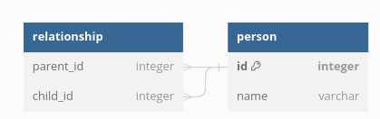
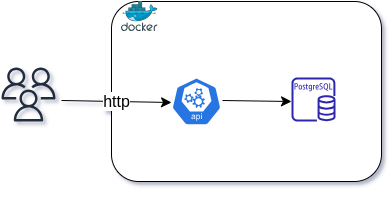

## Árvore genealógica

### O Problema

Nesse desafio deve-se criar uma API que expõe um endpoint HTTP<br/>
para a criação e manipulação de entidades Person.<br/>

``` 
{
"name": "string"
}
e relações de paternidade.
{
"parent": "Person.identifier",
"children": "Person.identifier"
}

```

⚠ Importante: Os corpos de entrada podem ter mais campos que os do exemplo, mas devem conter os campos<br/>
mostrados acima.<br/>
A API deve prover também um endpoint que retorna a árvore genealógica de um certo indivíduo contendo todos os
ascendentes possíveis até o seu nível. Por exemplo, suponha a seguinte família:


Se procurarmos pelo identificador de Bruce, a API deve retornar:<br/>
Bruce, Mike, Sonny, Phoebe, Anastasiae Martin. <br/>
Já se buscarmos pelo identificador de Phoebe, devem retornar os membros Martin, Anastasia, Phoebe.<br/>
O retorno deve prover todas as informações para que quem o consuma seja capaz de construir a árvore, minimizando
informações redundantes.

## Soluçao

No conceito de árvores genealógica, relação entre duas pessoas se dá pela ligação pais e filhos, ou seja, uma pessoa
poder ter um pai, uma mãe e filhos. Vale ressaltar que essas ligações são opcionais, como no caso de pessoas na raiz da
árvore, pessoas com pai ou mãe desconhecidos ou pessoas sem filhos.<br/>
Essa estrutura representada por uma tabela pessoa e outra tabela associativa contendo os identificadores dos pais e
filhos. Essa abordagem permitiria ligar uma pessoa a vários pais, entretanto, GENETICAMENTE falando, é impossível que
uma pessoa tenha mais de que dois pais. Portanto, adicionaremos validações para garantir que uma pessoa tenha no máximo
dois pais.



Dados de entrada:

``` 
{
    "name":"string",
    "parent": 1,
    "children": [1, 2]
}

```

### Consulta de ascendentes

A consulta de ascendentes receberá o identificador indivíduo e retornará sua árvore genealógica contendo todos os
ascendentes possíveis até o seu nível.

Tipo de resposta:

``` 
[
    {
        "id": 6,
        "name": "Mike",
        "depth": 0,
        "parents": [
            {
                "id": 1,
                "name": "Sony"
            }
        ]
    },
    {
        "id": 1,
        "name": "Sony",
        "depth": 1,
        "parents": null
    }
]

```

O campo depth representa o BACON'S NUMBER, mencionado como extras no desafio.

## Arquiterura



## Pre-requisitos

Golang 1.20.3<br/>
GoMock v1.6.0 <br/>
Docker 24.0.2<br/>
Docker Compose 14.1 <br/>
GNU Make 3.81<br/>
Postgresql 14.1<br/>

## Tecnologias

Golang, Golang-migrate, GoMock, Testify, Logrus<br/>
Docker, Docker Compose, git, GNU Make, Posgresql<br/>

## Instalaçao

Conforme mencionado no desafio, a aplicacao rodará em um docker container, por meio um docker compose contendo todas as
configuraçoes necessárias.

### Download

Para clonar o repositorio, execute o seguinte comando:

``` 
git clone https://github.com/ergildo/golang-family-tree.git && cd golang-family-tree

```

### Build

Para buildar a imagem docker, execute o seguinte comando:

``` 
docker build --tag golang-family-tree-api:latest .

```

### Rodar a aplicaçao

Para rodar a aplicacao, execute o seguinte comando:

``` 
docker-compose up -d

```

#### Observçao

Certifique-se que a imagem docker golang-family-tree-api:latest foi gerada corretamente.

### Migração de banco de dados

A migraçao de dados será executada automáticamente ao rodar a aplicacao. Além de criar o esquema de banco de dados, será
inserido uma carga inicial as seguintes pessoas:

Sony, Martin, Anastasia, Ellen, Oprah, Mike, Phoebe, Ursula, Eric, Ariel, Duny, Bruce, Jaqueline e Melody .

Conforme árvore genealógica mencionado no desafio.

### API

#### Consulta de ascendentes

GET<br/>
/api/v1/person/ascendants/{id}

Lista os ascendentes de uma pessoa por id.

Exemplo de resposta:

``` 
[
    {
        "id": 6,
        "name": "Mike",
        "depth": 0,
        "parents": [
            {
                "id": 1,
                "name": "Sony"
            }
        ]
    },
    {
        "id": 1,
        "name": "Sony",
        "depth": 1,
        "parents": null
    }
]

```

#### Listar pessoas

GET<br/>
/api/v1/person

Retorna a lista de cadastradas no sistema.

Exemplo de resposta:

``` 
[
  {
    "id": 1,
    "name": "Sony"
  },
  {
    "id": 2,
    "name": "Martin"
  }
]
```

#### Adicionar pessoa

POST<br/>
/api/v1/person<br/>

Adiciona um nova pessoa.

Examplo de requisiçao:

``` 
{
"name":"Ticio",
"parent": 13,
"children": [15, 16]
}
```

## Testes

Para rodar os tests, execute o seguinte comando:

``` 
go test ./internal/domain/service/... -v -cover

```

## Contatos

#### Dúvidas?

**e-mail:** ergildo@gmail

**whatsapp:** +46 76 081 36 43
